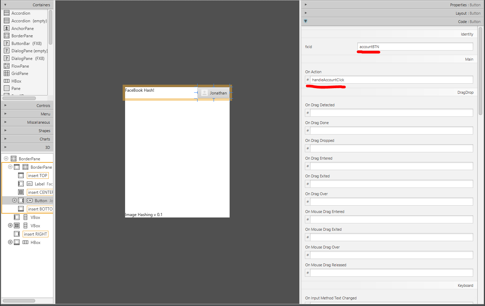

# JavaFX Demo

### Prerequisite reading

- A good place to start. https://www.tutorialspoint.com/javafx/

- I used two tutorial for the software engineering project which was written entirely in Java. The first one can be found here https://code.makery.ch/library/javafx-tutorial/. The second one which contains information on database operations can be found here https://www.swtestacademy.com/database-operations-javafx/?fbclid=IwAR0hVugD9tb_ZOumM6E9e3j0kSKbHK6pDHALinPun4wlBRQtW74IRZKvHZY.

- The GUI in the demo was based on this application. https://www.callicoder.com/javafx-css-tutorial/. This application was written by callicoder. Callicoder's github link is here https://github.com/callicoder/javafx-examples. He has other examples if you're interested. 

- I would also read up on Model View Controller if anyone doesn't know what that is. https://en.wikipedia.org/wiki/Model%E2%80%93view%E2%80%93controller

- Here is some reading material on event handlers. https://www.tutorialspoint.com/javafx/javafx_event_handling.htm and maybe read up on anonymous inner classes.

  

### Installation and what is required (windows)

#### What's required

- Download and install the newest version of Intellij. https://www.jetbrains.com/idea/
- Download and install Java 11 JDK. Link is here, https://www.oracle.com/technetwork/java/javase/downloads/jdk11-downloads-5066655.html
- After you install Java you have to set up the Path for Windows. Click on this link https://www.tutorialspoint.com/javafx/javafx_environment.htm and go to "Setting up the Path for Windows." I didn't do this to run the demo. But it will save you trouble in the future. 
- Download JavaFX 11 SDK. https://gluonhq.com/products/javafx/. Unzip the contents to anywhere you like. I placed my in C:\Program Files\Java.

#### Running the Demo

1. Open Intellj and click import project. Import the folder name SeniorProjectDemo. Click next leave all options by default. It might ask you to overwrite .idea folder. You can click reuse. 
2. Once its imported, click on file, click on project structure. In project click Project SDK: java 11. If its not listed click on new. Find your java 11 folder. It should look something like this. C:\Program Files\Java\jdk-11.0.2. After you find it click apply. 
3. Because JavaFX is no longer included with java 11. You have to add it modules. So inside project structure. Inside Global Libraries click on the plus sign and click on java. Find your javafx folder lib folder. For me it looks like C:\Program Files\Java\javafx-sdk-11.0.2\lib.
4. Inside the lib folder. Highlight and click ok for all the .jar files. 
5. Intellj will ask you if you want to add these jar files in SeniorProjectDemo modules. Click yes.
6. The name of the library will be call javafx-swt. I renamed my to javafx11. 
7. Now go to Modules in project structure. Click on Dependencies. You should see javafx-swt or java11 if you renamed it.  Note: Every time you import a javafx project you should go to project structure and inside Global Libraries right click on java11 library and click add to modules for the specific project. 
8. Make sure your SDK is java 11.  Hit apply.

- Errors I encountered doing these steps on my desktop. 

- There is no run button.

  ```Java
  public class Main extends Application{
      //There should be a green play button next to public.
  }
  ```

  - I used this fix. Right click on **src** directory and select option **Mark Directory As** > **Sources Root**.

- Another error I encountered was. Cannot start compilation: the output path is not specified for module "SeniorProjectDemo". Specify the output path in the Project Structure dialog. Here is the fix I used. You have to define the `project compiler output` in `File` -> `Project Structure...` -> `Project` -> `Project compiler output`: The folder should look like this. C:\Users\Jonathan\IdeaProjects\SeniorProjectDemo\out

### The Demo Itself

​	The demo itself isn't large, and after reading up on JavaFX tutorials and understanding the concept of Model View and Control. The demo isn't hard to understand. I going to give you a basic example.

​	The demo.fxml is the view. The user only sees the view. When the user clicks on a button he is interacting with the controller. The controller will update the model and display it back on view. I suppose the model can be the image view. Another example of model would be me modifying an account object and saving it to the database. 

​	The DemoController.java is what the user uses to interact with. It contains references to different parts or objects of the GUI. How do you get a reference? There are two ways.

Below is code written in the demo.fxml file.

```account button
<Button id="account" fx:id="accountBTN" onAction="#handleAccountClick" text="Jonathan">

</Button>
```

The fx: id = "accountBTN" can be used like this inside the DemoController.java 

```jav
    @FXML
    private Button accountBTN;
```

The `@FXML` tells JavaFX that this object is created within the `FXML` file, not the Java code itself.

There is another way of setting the fx:id. Go into scene builder, click on the button you want to name. Click on "code", and inside fx:id type in whatever name you want.



​    

How about the action of the button. There are two ways that I know of. 

```java
    @FXML
    private void handleAccountClick(Event event){
        System.out.println("Hello World!");
    }
```

If you look at the image above below "fx:id" is "OnAction". you can write down the name of the function you wrote inside DemoController.java.

```xml
                <Button id="account" fx:id="accountBTN" onAction="#handleAccountClick" text="Jonathan">

                </Button>
```

You can also set the onAction inside the demo.fxml file. When running the program. If you click on the Account Button icon you can see the words "Hello World!" print out in Intellij.


### The initialize function

You don't have references to the GUI objects like buttons inside the constructor. So you can't set up the button inside the constructor. Instead you write the initialize function which gives you references to all your GUI objects.  Below I am able to modify my GUI objects anyway and set up default images or default labels. I was able to set the default image this way. 

```java
        image_holder.setImage(new Image(defaultImage));
```

Any function pertaining to the fxml file needs the annotation @FXML.

```java
    @FXML
    private void initialize(){
        image_holder.setImage(new Image(defaultImage));
        imageScaleUp();
        accountBTN.setOnAction(new EventHandler<ActionEvent>() {
            @Override
            public void handle(ActionEvent actionEvent) {
                System.out.println("This function was written inside a event handler.");
            }
        });
    }
```

​	There is a third way of giving the account button a function. You can create an event handlers. For example if for some reason you don't feel like using the scene builder of demo.fxml file to label the OnAction fucntion. You can write an event handler for that button and give it an anonymous inner class and define the button's function is inside the handle function. If you were to add this code to the demo and click on account. It will display "This function was written inside a event handler.". Setting event handlers for GUI objects is something I haven't done much. I mainly use the fxml file or scene builder.

### Scene Builder

​	Scene builder is a tool that allows you to drag and drop GUI items. You can adjust just about everything  in scene builder. Everything you do in scene builder affects the fxml file and vice versa. So you can use whatever your comfortable with. I like to switch between fxml and scene builder to learn how fxml is written. 


