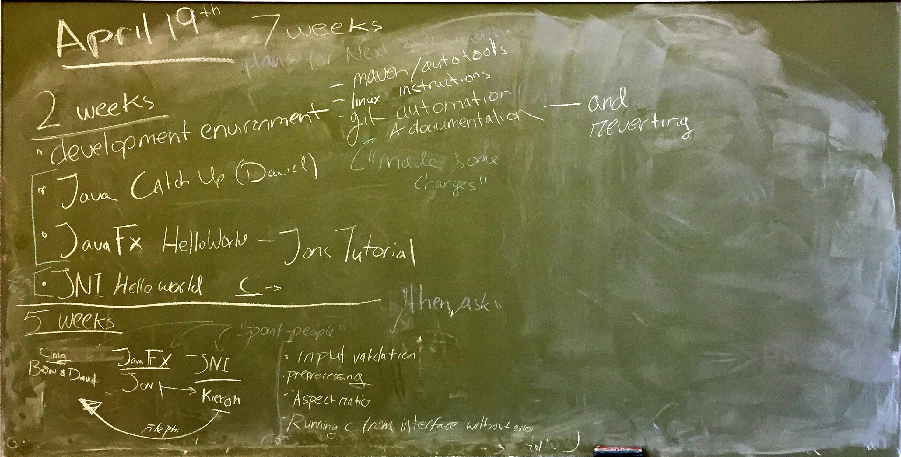
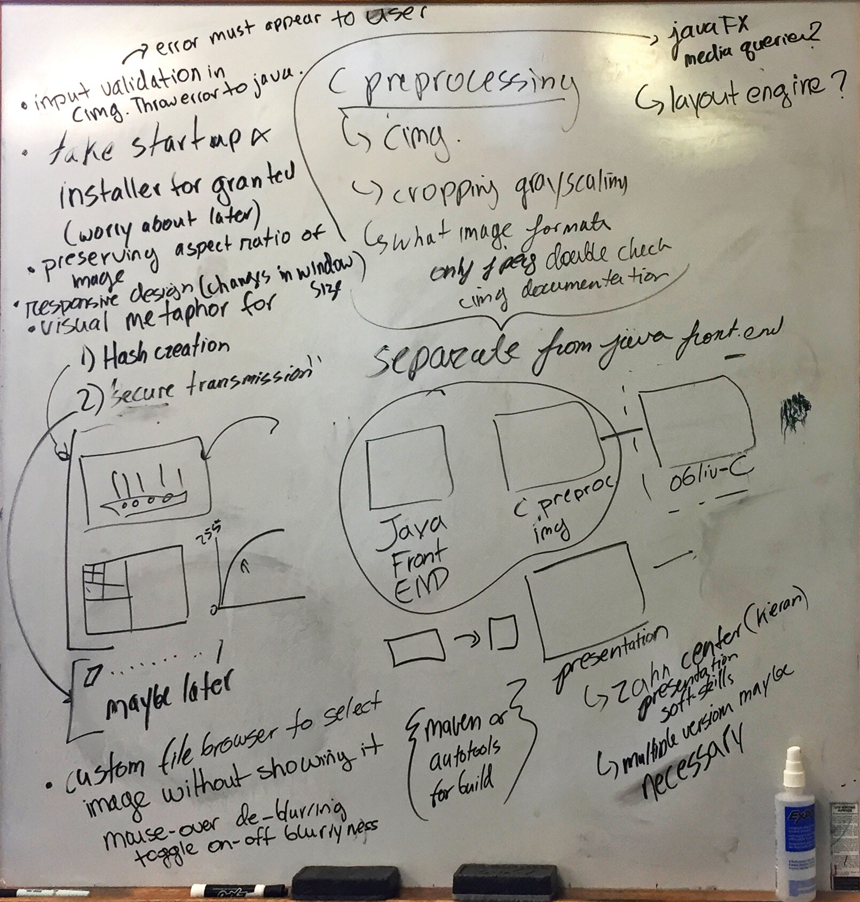

# Design Goals Until April 19th

Let's work on the interface and on input validation until spring break  (no longer need to worry about using JNI for linking obliv-C to the JAVA GUI.)  I images from our whiteboarding session; the features we'll implement by spring break are only a subset of the ones shown on the images.

## Interface Elements

- Preserving the aspect ratio of the image, in the input window (currently when an image is dragged into the window, if it's rectangular it is forced into a square shape)
- responsive design
    - 3 separate XML files needed (small, medium, and large) along with corresponding business logic that takes the window size and changes the interface accordingly.

    - here are some useful links on stackoverflow, one using [border pane](https://stackoverflow.com/questions/40320199/how-to-automatically-resize-windows-in-javafx-for-different-resolutions) and another suggesting [flow pane](https://stackoverflow.com/questions/32021293/javafx-creating-a-responsive-layout) . Here's a blog post from [GUI Garage](http://www.guigarage.com/2015/09/how-to-create-a-responsive-layout-in-javafx/) and another post from [Java Code Geeks](https://www.javacodegeeks.com/2013/09/responsive-design-with-javafx.html). I'm not sure which approach is best, but I guess these articles give us information about where to start.

        
- visual metaphors for secure transmission and hash creation

## Image processing ([CImg](http://cimg.eu/) or [OpenCV](https://opencv.org/))

- input validation on acceptable image types. Validation error messages must appear to the end-user through dialogue boxes or warning messages e.g."malicious.exe is not an image" 

