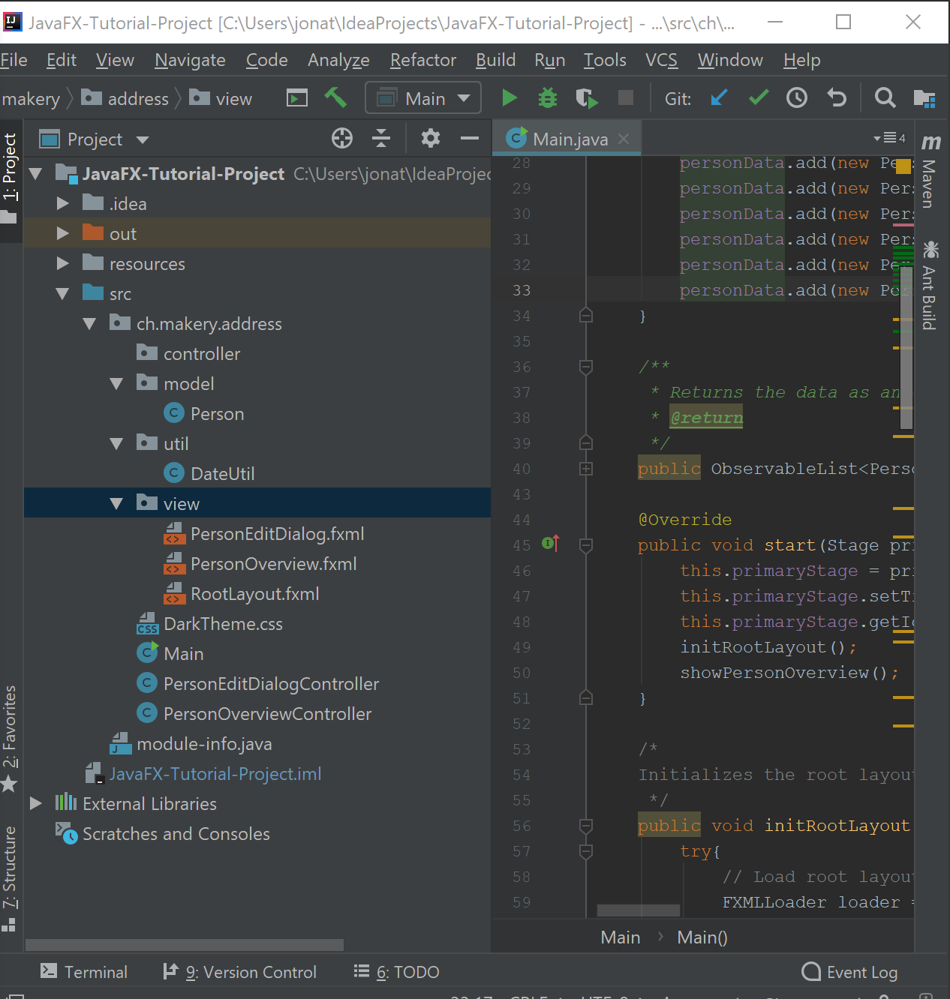
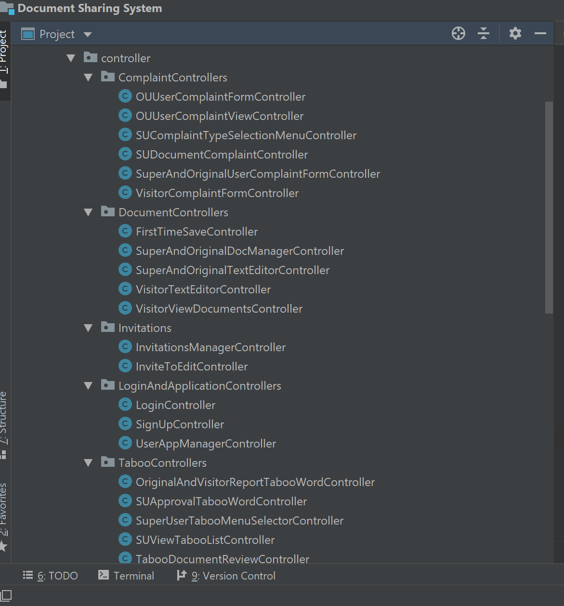
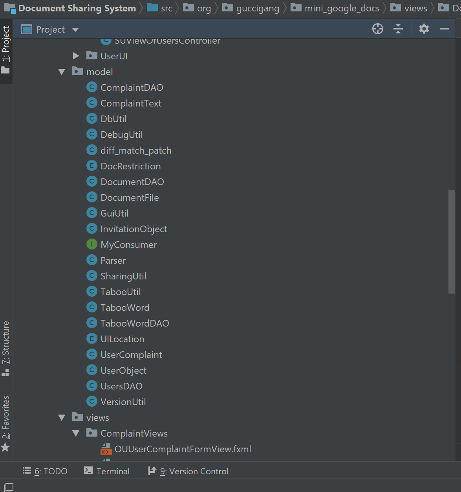
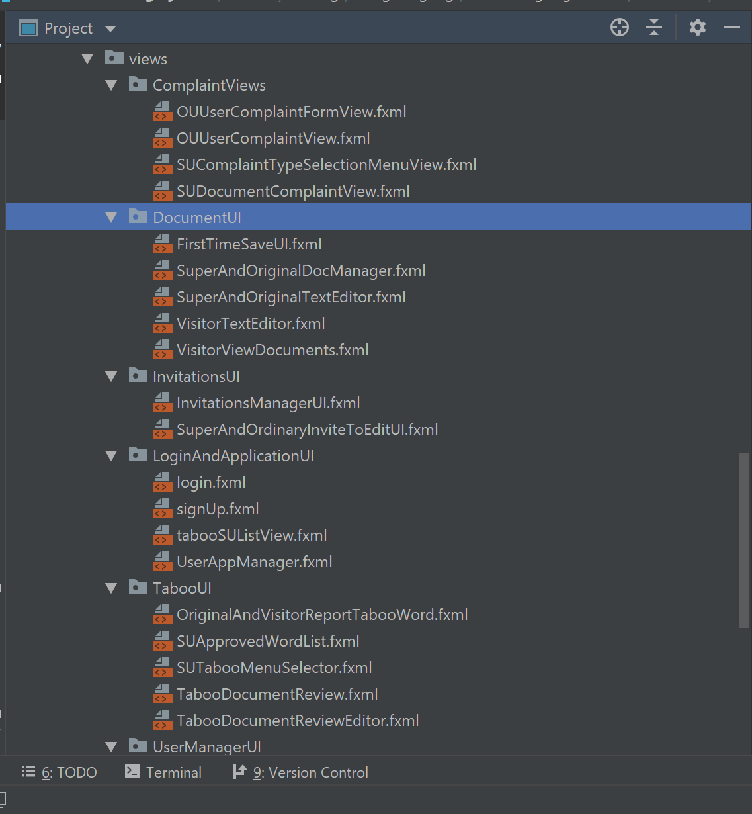

# Java and IntelliJ 

## Project Structure 

- If we use maven the structure maybe different, but it looks like we won't be using maven unless someone changes their mind.
- This is based on my experiences with java. If you guys have better suggestions bring it to the groups attention please.  
- We should separate our files by these three main things. Model, controller, and view. May even a util package.
  - Model are java objects that are mostly used to display information. For example. If we were to implement a search for users feature. Each user displayed in the search result is a user object. You can then use these user objects to display the user's profile. (user1.getName() to display the user's name).
  - Controller is where our logic will mostly reside basically its the brains of the application. It acts is a connector between the model and view, receiving user input and deciding what to do with it.
  - View is our FXML files. The view code/files is what the user interacts with. Basically the GUI.
  - util is where our helper functions will go maybe we can put our css files there. i.e functions like parsing a string, communicating with the database. 
- Below is an example.

- Now since we are making two applications. One for developers, and another one for users. We could separate it by having two packages.  I don't think is necessary since the developer's version will use the user's application to show the backend (more information).  I don't think the project will be that large also. Since its just one window for each application. 
- What is the difference between a folder and a package? 
  - No difference. Intellij will display src/com/naishe/test as com.naishe.test. 
  - Why? A package is a way of grouping related classes/source files. Its a way of organizing code. It can also work a way for java to find code you're importing.  
  - Anyway packaging helps us to avoid class name collisions when we use the same class name as that of others. 
  - Heres an explaination off stackoverflow
    - For example, if we have a class name called "Vector", its name would crash with the Vector class from JDK. However, this never happens because JDK use java.util as a package name for the Vector class (java.util.Vector). So our Vector class can be named as "Vector" or we can put it into another package like com.mycompany.Vector without fighting with anyone. The benefits of using package reflect the ease of maintenance, organization, and increase collaboration among developers. Understanding the concept of package will also help us manage and use files stored in jar files in more efficient ways."

### Here's is what Jonathan's and Kieran's Software Engineering Project structure looked like.

- Model
- Model

- View

# What are these folders and what do they? 

- First don't commit the .idea folder and the iml at the root directory. We only need the out folder and src folder. If you do commit them its ok. Just delete it, its no biggie. 

- Here's what I found off google.

  - IML is a **module** file created by IntelliJ IDEA, an IDE used to develop Java applications. It stores information about a development **module**, which may be a Java, Plugin, Android, or Maven component; saves the **module** paths, dependencies, and other settings.

- From my readings it looks like the iml files are created by the IDE and since we are all using the same IDE (intellij) We can ignore the iml file when committing. The iml and .idea can be regenerated via importing project.  

- What is the .idea folder? When using Intellij all the project's specific settings are stored in the .idea folder. 

  - > Project settings are stored with each specific project as a set of xml files under the .idea folder. If you specify the default project settings, these settings will be automatically used for each newly created project.

- What is the the module-info.java file?

  - In Intellij, module is an essential part of the project. I honestly am still a little confused about this since there's so much information, but It looks like a way for importing external libraries into the project so java can reference it. 

  - Here are some links I found
  - <https://softwareengineering.stackexchange.com/questions/311280/why-packages-and-modules-are-separate-concepts-in-java-9>
  - <http://tutorials.jenkov.com/java/modules.html#module-descriptor-module-info.java>
  - From my readings it looks like a lot of things in java is a module. A method is a module, class, and package. A module is a unit of organization in which internal details are hidden, and that communicates with other modules via agreed contracts. 
  - The module-info.java is a module descriptor. The module descriptor specifies which packages a module exports and what other modules the modules requires. So it does look like a way for modules to communicate with each other i.e reference. 